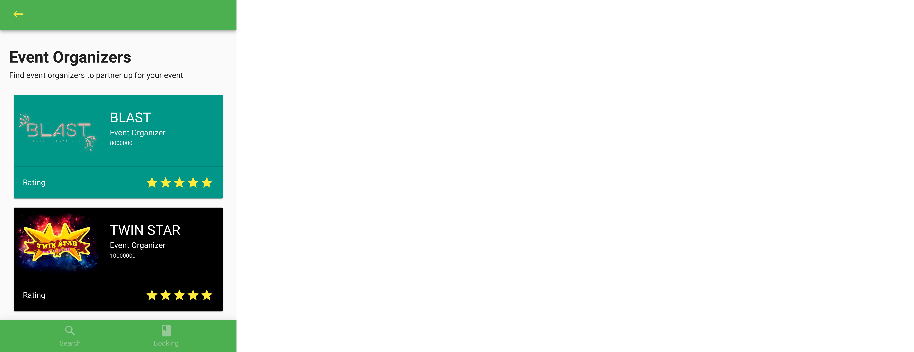
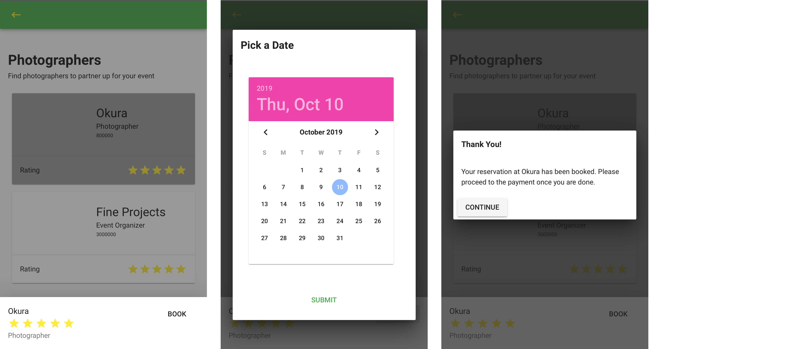

#EventOnTheGo

EventOnTheGo is a VueJS-based application that allows users to held an event by hiring companies that provides your needs for the needs of your events. Whether its an event organizer, entertainments, catering, or photographers, all you need to do is book them with EventOnTheGo.

For a demo to the application, please click [here](http://entre-vue-deploy.herokuapp.com/#/). Please use your <b>mobile phone</b> to test it.

To use the app, just click on the category you'd like to explore. For example, you may need a place for your event. You can go and pick "Venue" to explore what venues are available.

The booking process is pretty straight-forward. All you need to do is select the date and time of the event. The app will tell you whether that date and time you book is available.

Once the booking is done, you may check on other categories to spice your event up. They will be stored in the "Booking" tab, where they will accumulate the total price of the bookings you made. The application will handle the process, so that a single purchase will handle all your bookings.